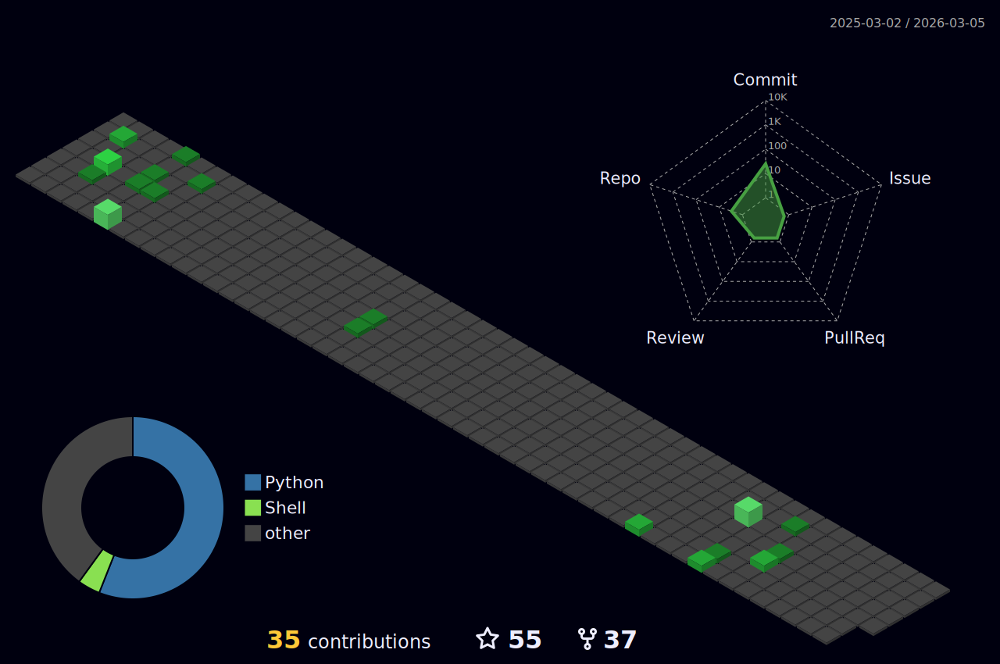

### hey there 

<a href="https://twitter.com/amitya_dav">
  
</a>
<a href="https://www.linkedin.com/in/amit-yadav-9a417318a">
  
</a>

<!---
<a href="https://www.instagram.com/amitya_dav/">
  
</a>


<a href="https://www.youtube.com/channel/UCXABr3Eoq4tNpPXpKI62PxA">
  
</a>
-->


<br />

hi, i'm [Amit Yadav](http://iamamit.me/I_am_Amit/), a passionate self-taught AI and Machine Learning developer and a freelance software engineer from India. my passion for software lies with dreaming up ideas and making them come true with elegant projects. i take great care in the experience, architecture, and code quality of the things I build.

i am also an open-source enthusiast and maintainer. i learned a lot from the open-source community and i love how collaboration and knowledge sharing happened through open-source.


<!---
```
const amit = {
    pronouns: "He" | "Him",
    code: [ "Python", "JAVA", "CPP"],
    askMeAbout: ["machine learning","artificial intelligence", "tech", "cyber security", "blockchain", "QA", "linux"],
    technologies: {
    	machine learing:{
	    framework: ["Tensorflow", "Pytorch", "Open-CV"]
	    cloud work:["GCP", "AWS", "AZURE"]
	},
        devOps: ["AWS", "Docker🐳", "GCP", "GitHub Actions", "CircleCI"],
    },
    workplace: {
                college: 'NIET',
                course: 'B-Tech',
		specialization : 'AI and machine learning'
    },
    currentProject: "I am developing an AI based mentoring system",
    funFact: "There are two ways to write error-free programs; only the third one works",
    availableForHire: true
};
```

-->


  
  
- 💼 any freelance work? do reach, [email](mailto:amitech90@gmail.com) :)
- 💬 ask me about anything, i am happy to help;

**languages and tools:**  

<code></code>
<code></code>
<code></code>
<code></code>
<code></code>
<code></code>
<code></code>
<code></code>
<code></code>
<!-- <code></code> -->


if you like what i do, maybe consider buying me a coffee/tea 🥺👉👈

<a href="https://www.buymeacoffee.com/warriorwizard" target="_blank"></a>


 

📈 my github stats  
<!---
<p>
<snap> 
<snap> 
 </p>
--->
<p align="center">
	
	 
	<br/>
	

	
</p>
<p>	Note: Top languages is only a metric of the languages my public code consists of and doesn't reflect experience or skill level.</p>





<!-- [](https://twitter.com/amitya_dav) -->

[](https://holopin.io/@warriorwizard)


 


