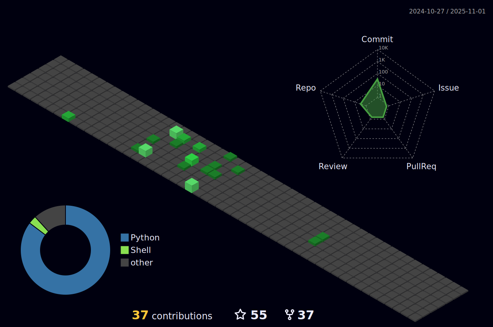

### hey there 

 

hi, i'm **Amit Yadav**, an AI Engineer working on **computer vision, agentic systems, and production-grade GenAI**.  
I enjoy building AI systems end-to-end — from model training to deployment, orchestration, and monitoring.

I care deeply about clean architecture, reproducibility, and shipping things that actually work in production.

---

- GenAI Engineer (AI agents, RAG, automation)
- computer vision & multimodal ML
- ML systems, deployment, and infra
- open to freelance & collaborations

📫 **amitech90@gmail.com**

---

### current focus

- multi-agent GenAI workflows (MCP, ADK, A2A)
- vision systems (YOLO, OCR, real-time pipelines)
- multimodal pipelines (text, vision, audio)
- ML infra, monitoring, and evaluation

---

### languages & tools

<code></code>
<code></code>
<code></code>
<code></code>
<code></code>
<code></code>
<code></code>
<code></code>

---

### selected work

- **Enterprise GenAI Agents**  
  Multi-agent workflows for knowledge retrieval, automation, and developer assistance.

- **Vision & OCR Systems**  
  Real-time detection, OCR, and analytics using YOLO, PaddleOCR, OpenCV.

- **Scene-based AI Video Pipeline**  
  Script → scenes → TTS → image generation → final rendered video.

- **MCP Server**  
  LLM-driven access to internal APIs using Model Context Protocol.

---

if you like my work, you can support it here

---

